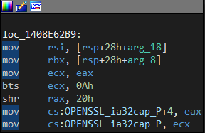
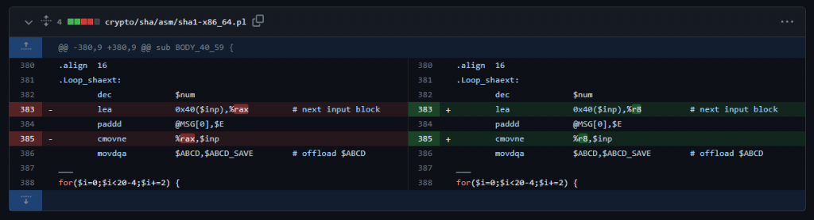
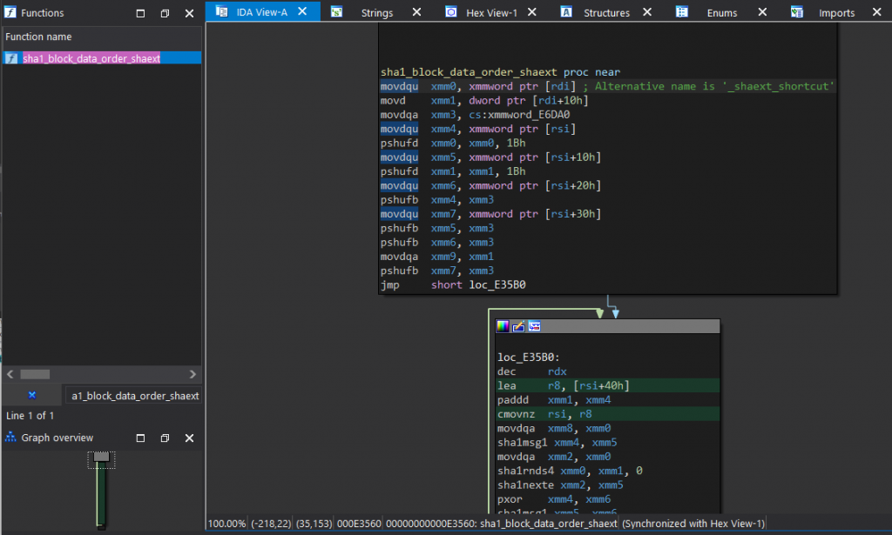
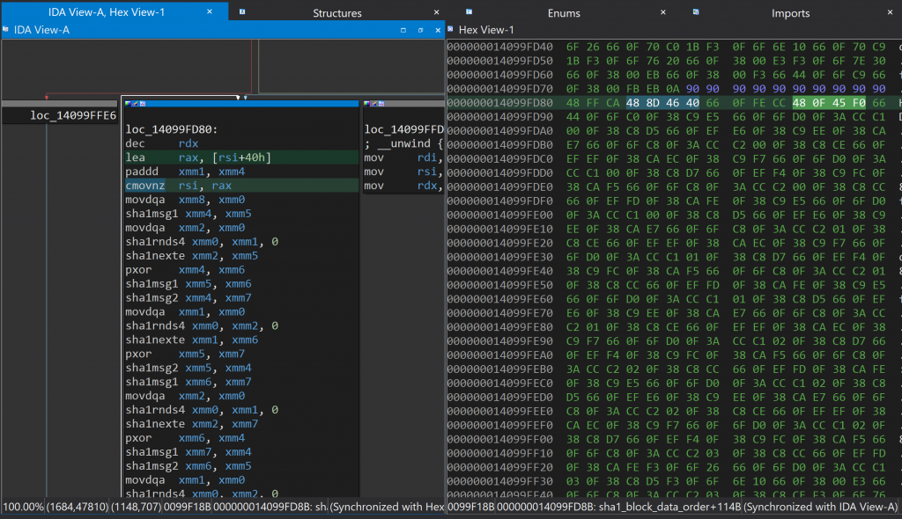

This document describes steps taken to binary patch a crash that was occurring in Besiege (Microsoft Store, 64-bit) and the 64-bit Unity Editor.

> 💡 Source code is available on GitHub: [https://github.com/eamonwoortman/openssl-universal-patcher/](https://github.com/eamonwoortman/openssl-universal-patcher/)

---

## Introduction 📖

At the time of writing, we are trying to deploy a new update for **Besiege** on the Xbox PC/Microsoft Store platform.

However, a couple of users have reported that the game doesn't open or crashes immediately. The crash logs that we received all contained the last stack trace line:

```
invalid_pointer_read_c0000005_besiege.exe!sha1_block_data_order
```

After troubleshooting, we narrowed the problem down to our workshop integration ([Mod.io](http://mod.io/)). It was trying to establish an HTTPS connection through the [UnityWebRequest](https://docs.unity3d.com/ScriptReference/Networking.UnityWebRequest.html).

Besiege was built with the older *64-bit 5.4.0f3 Unity* version, which used the `1.1.0-dev` OpenSSL library. It appears that in the Unity 5.4.0f3 Editor, and builds made with it, there's a bug where apps that use OpenSSL (i.e., secure web request) crash for users with specific hardware specifications, specifically **10th Gen and 11th Gen Intel CPUs**.

One of our team members actually had one of these Intel models, and not only did the game build crash, but the *64-bit 5.4.0f3 Unity Editor* also crashed upon launching.

A Reddit user called 'shishire' and commenters have already described the problem in [this topic](https://www.reddit.com/r/Smite/comments/pl35y6/comment/he16988/?utm_source=share&utm_medium=web2x&context=3):

> *The actual failure going on here on 64-bit is happening in a dll called MctsInterface.dll, and it's occurring during a pointer dereference to a floating point number that tries to access memory that's outside the bounds of what's actually available to the application. That being said, one of the things I noticed is that the function this is a part of does a whole bunch of sha1sum operations in cpu-space.*

Additionally, Intel has released a short article about the issue. You can read [their article](https://www.intel.com/content/www/us/en/developer/articles/troubleshooting/openssl-sha-crash-bug-requires-application-update.html) for more information and additional workarounds.

### Existing Workaround

There's a workaround to the crash that involves setting an environment variable on the system. This variable instructs OpenSSL to use software-based hashing instead of hardware-based hashing:

1. Open the Control Panel and navigate to System and Security > System > Advanced system settings.
2. Click on the **Environment Variables** button.
3. Under **System Variables**, click on **New** and enter:
   - Variable name: `OPENSSL_ia32cap`
   - Variable value: `~0x20000000`
4. Click OK to save the changes.

### Patching Motivation

Although this workaround might work for some users, it is not a permanent fix. Without the workaround, users would experience a crash immediately after downloading the game. Requiring users to change system environment variables does not provide a great user experience, so we sought a way to patch our game.

---

## My patching journey 🩹

### Attempt #1: Calling `SetEnvironmentVariable` ❌

I first set out to try to replicate the environment variable workaround through code. C# has a way of setting application-specific environment variables through [Environment.SetEnvironmentVariable()](https://learn.microsoft.com/en-us/dotnet/api/system.environment.setenvironmentvariable?view=netframework-4.0). So I used it to set the `OPENSSL_ia32cap` variable to `~0x20000000`.

However, after trying it, we found that the game was **still crashing**, even though the process's environment variable had changed.

After thinking about it some more, this is probably because the OpenSSL initialization is part of the native Unity player and is already initialized before the mono domain is created. One way of how I could see this type of fix working is to wrap your game executable with another app (C# in this case) that would use `SetEnvironmentVariable()` before launching the inner app.

Unfortunately, we don't have any wrapper application around our game, so we can't set the environment variable like this.

> 🚧 **Roadblock 1**

---

### Attempt #2: Binary patching ❌

My next attempt would be to either patch the game executable to always set the `OPENSSL_ia32cap` to `~0x20000000` or somehow patch the function that would use the flag's value.

I looked up the OpenSSL repository and found a function called `OPENSSL_cpuid_setup` in [cpuid.c](https://github.com/openssl/openssl/blob/c8093347f736c7991350d26048b680d0e64974a0/crypto/cpuid.c#L106).

The `OPENSSL_cpuid_setup` function is responsible for initializing the OpenSSL library. It checks the processor vendor ID and feature flags to determine which cryptographic algorithms are available and whether hardware acceleration is supported.

I opened the game binary in [IDA](https://hex-rays.com/ida-free/) and looked up the same function. At the very end, I found the instruction that would set the `OPENSSL_ia32cap` variable:



My options here were either to patch that part of the method so it would always unset the `0x20000000` value from the `OPENSSL_ia32cap` flag, or to somehow force the environment variable setting to be a constant string of `"~0x20000000"`.

I was in the middle of trying the first option, but I then realized I would need more instructions (more bytes) than were present. I couldn't simply replace an existing instruction without altering the functionality.

After reading up on it, I learned that inserting instructions means looking up some kind of NOP/empty part of the binary and jumping to there from the original code. Because I have limited assembly/cracking experience, I wasn't comfortable with doing this. So I decided to stop this experiment and look for alternatives.

> 🚧 **Roadblock 2**

---

### Attempt #3: Binary patching (2) ✅

While looking into setting the environment variable, I stumbled upon one of my many open browser tabs that actually contained the fix that [OpenSSL did in their 1.0.2L patch](https://github.com/openssl/openssl/commit/7123aa81e9fb19afb11fdf3850662c5f7ff1f19c#diff-fd85954e17364d4495e1e077a5768e4e).



This patched a function called `sha1_block_data_order_shaext`, which was the Intel-specific implementation of the SHA1 `sha1_block_data_order` function.

It's not a coincidence that the crashes that users reported were all caused in a function called `sha1_block_data_order`.

#### Finding the instructions to patch

Next up was to use IDA and find the corresponding instruction in the game executable. I actually built the patched OpenSSL earlier, so I opened the `openssl` lib in there and looked up the original `sha1_block_data_order_shaext` function.

Looking up the function name was enough to take me to the corresponding function block.



And we actually found the ***patched*** instructions we needed:

```asm
lea     r8, [rsi+40h]
...
cmovnz  rsi, r8
```

From the earlier patch commit on [OpenSSL's GitHub Repo](https://github.com/openssl/openssl/commit/7123aa81e9fb19afb11fdf3850662c5f7ff1f19c#diff-fd85954e17364d4495e1e077a5768e4e), we already know they changed the `RAX` register to `R8`.

So to look up the instruction we needed in our game binary, we simply need to reverse the patch:

```asm
lea     rax, [rsi+40h]
...
cmovnz  rsi, rax
```

#### Matching the patch instructions in our game

In IDA, I opened up our game binary, jumped to the `sha1_block_data_order` function, and found the corresponding instructions (`lea rax…`, `cmovnz rsi …`) in a block after a couple of jumps.



*To-be-patched instructions, 4 bytes apart*

If we observe the Hex View on the right, you'll notice that I've also marked the corresponding bytes of the two to-be-patched instructions. There are 4 bytes between the two instructions; this will be important later.

I wanted to verify what I was seeing is correct. Since I'm not fluent in assembly and bytecode, instead of Googling and reading up on assembly instructions, I asked **ChatGPT** what the corresponding bytes are for each instruction.

At the time of writing, the AI chatbot was still benevolent and obedient, so it told me the answer:

```asm
# lea     rax, [rsi+40h]
48 8D 46 40

# cmovnz  rsi, rax
48 0F 45 F0
```

This matches what we've seen in the Hex View! 🤘

I also asked GPT to tell me what byte to change if I wanted to change the address from `rax` to `r8`, and it basically gave me a patchable diff:

```asm
-- First sequence --
# lea     rax, [rsi+40h]
original: 48 8D 46 40
# lea     r8, [rsi+40h]
patched: 4C 8D 46 40

...

-- Second sequence --
# cmovnz  rsi, rax
original: 48 0F 45 F0
# cmovnz  rsi, r8
patched: 49 0F 45 F0
```

> 💡 Note: I'm aware you can change instructions in IDA by using Edit → Patch Program → Assemble. But when I tried changing `rax` to `r8`, IDA refused with an "Invalid Operand" error. According to [this Stack Overflow reply](https://stackoverflow.com/a/38529308), it's because the Assemble patcher only supports a limited amount of operations.

With the diff file generated, I can use it to apply the patch to the game binary file programmatically. This will allow for easier and faster patching of the game binary file for each new build.

---

## Next step; Write a patcher program ✍️

Now we only need to write a simple program that patches the game binary file. Once we have a patcher, we can include it in our build pipeline before packaging the game.

IDA does provide a diff/patching method, but it uses a fixed memory offset. This doesn't work if we're going to update the game after the initial patch as the memory offsets change due to changes in code. So we need something that's a bit more clever than a simple offset byte patcher.

### BSDiff / BSPatch

Before writing my own diffing and patching tool, I searched for an existing one and found [bsdiff](http://www.daemonology.net/bsdiff/), or more specifically, its [.NET port](https://github.com/LogosBible/bsdiff.net).

To create a diff, I first needed to patch our game binary (`Besiege.exe`). I used the byte code provided by GPT and applied the patch in IDA (Edit → Patch Program → Change Byte), saving a new patched game binary (`Besiege.patched.exe`).

Next, I used **bsdiff** to create a diff between the old, unpatched game binary and the freshly patched one.

Using this diff/patch file, I was able to patch a fresh new game build, even with code changes, and verified that the patch was working. I implemented the patcher in our build pipeline by calling **bspatch** after every successful build, just before packaging it.

**Success, right?**

Not quite…

While this method would work for our own game, unfortunately, on this particular platform, this patch wouldn't work on *any* application that was built on this old OpenSSL library. Although my goal isn't to make a universal patcher, I'm not sure how well this BSDiff patch holds up against massive code changes.

And to be completely honest, I wanted to see if it was possible to create a more universal patcher so we could fix the *Unity 5.4.0f3 64-bit Editor* from crashing, for example.

### Writing our own patcher

#### The patch

So we know we only have to patch *2 bytes*, one for the `lea` instruction and one for the `cmovnz` instruction. We also know the sequence they're in and even the relative offset relative to each other, which is *4 bytes*.

Now we can hardcode this into our patcher, but for the sake of readability and transparency, I decided to put all the patching information in a [single text file](https://github.com/eamonwoortman/openssl-universal-patcher/blob/master/src/OpenSSLUniversalPatcher/Resources/openssl.universal.patch):

```patch
# lea     rax, [rsi+40h]
original: 48 8D 46 40
# lea     r8, [rsi+40h]
patched: 4C 8D 46 40
# 4 bytes from the previous instruction
offset: 4
# cmovnz  rsi, rax
original: 48 0F 45 F0
# cmovnz  rsi, r8
patched: 49 0F 45 F0
```

*openssl.universal.patch*

#### The patching application

Once again, I asked ChatGPT to help me get started, and it did an okay job of outlining the patcher application. Although it was broken at first, it provided enough groundwork to get me started.

The C# console application performs the following steps:

1. Load the **target binary** as a `byte` array
2. Parse the **patch file** into a `Patch` class
3. Find any number of occurrences of the byte sequences that need to be patched
4. Replace these byte sequences in the original `byte` array with our patched bytes, but only if exactly one occurrence is found
5. Write the patched bytes to a new binary file

The main patching method ended up looking like this:

```csharp
public static bool Apply(string inputPath, string outputPath, string patchFileText) {
    byte[] originalBytes = File.ReadAllBytes(inputPath);
    Patch patch = ParsePatchFile(patchFileText);

    List<PatternOffsets> offsets = FindSequencePattern(originalBytes, patch.FirstSequence, patch.SecondSequence, patch.RelativeOffset);
    if (offsets.Count == 0) {
        Console.Error.WriteLine("Error, pattern not found in target.");
        return false;
    }
    if (offsets.Count > 1) {
        Console.Error.WriteLine("Error, pattern found multiple times in target.");
        return false;
    }

    Console.WriteLine("Sequence pattern found in target, patching...");

    var patternOffsets = offsets[0];
    var firstOffset = patternOffsets.FirstOffset;
    var secondOffset = patternOffsets.SecondOffset;

    // Apply the first sequence patch
    var patchedBytes = patch.FirstSequence.Patched;
    Array.Copy(patchedBytes, 0, originalBytes, firstOffset, patchedBytes.Length);

    // Apply the second sequence patch
    patchedBytes = patch.SecondSequence.Patched;
    Array.Copy(patch.SecondSequence.Patched, 0, originalBytes, secondOffset, patchedBytes.Length);

    // Write the patched bytes to the output file
    File.WriteAllBytes(outputPath, originalBytes);

    Console.WriteLine("Patched file written to " + outputPath);
    return true;
}
```

```csharp
struct PatternOffsets {
    public int FirstOffset;
    public int SecondOffset;
}

struct SequencePair {
    public byte[] Original;
    public byte[] Patched;
}

class Patch {
    public SequencePair FirstSequence;
    public SequencePair SecondSequence;
    public int RelativeOffset;
}
```

#### A Couple of Gotchas

When writing this patcher, there were a couple of things to watch out for. Firstly, it was important to ensure that the two-byte sequences were found *in pairs*, with the relative offset between them. Otherwise, we might end up patching two entirely unrelated sequences that just happened to look similar.

Secondly, even though the sequence pair is unlikely to occur more than once, I wanted to make sure that the patcher would stop patching if it did.

---

## Testing it 💯

While developing the patcher, I tested whether the assembly instructions were changed in the patched executable. Additionally, I confirmed with my colleague on the specific compromised Intel hardware.

| App | Engine | Patch compatible | Confirmed IDA | Confirmed on Hardware |
|-----|--------|:----------------:|:-------------:|:---------------------:|
| Besiege | Unity v5.4.0f3 | ✅ | ✅ | ✅ |
| Unity Editor | Unity v5.4.0f3 | ✅ | ✅ | ✅ |
| Test Game | Unreal 4.21.2 | ✅ | ✅ | ❌ |

The only app which I haven't verified whether it would fix the crash on the specific Intel hardware is the Unreal Test Game. The test game itself is a boilerplate FPS Game template that comes with Unreal 4.21.2. I did verify the before and after in IDA and could confirm that it was compromised with the same faulty OpenSSL code and that the patch would fix it.

---

## Conclusion 🏁

With a little bit of effort, we were able to repurpose the existing, [internal OpenSSL library patch](https://github.com/openssl/openssl/commit/7123aa81e9fb19afb11fdf3850662c5f7ff1f19c#diff-fd85954e17364d4495e1e077a5768e4e) into an all-purpose, universal binary patch. Although, disclaimer: "universal" might be a stretch. This may work for these particular apps and engine versions, but it may not work for your particular situation.

All code is available for free on GitHub: **[https://github.com/eamonwoortman/openssl-universal-patcher/](https://github.com/eamonwoortman/openssl-universal-patcher/)**

If you found this even slightly useful or an interesting read, please consider buying me a coffee! 🙏

---

## Resources

### OpenSSL
- [cpuid.c](https://github.com/openssl/openssl/blob/c8093347f736c7991350d26048b680d0e64974a0/crypto/cpuid.c#L106) — The `OPENSSL_cpuid_setup` function in the OpenSSL repository
- [OpenSSL 1.0.2L patch](https://github.com/openssl/openssl/commit/7123aa81e9fb19afb11fdf3850662c5f7ff1f19c#diff-fd85954e17364d4495e1e077a5768e4e) — Commit with the Intel-specific SHA1 fix
- [OpenSSL repository](https://github.com/openssl/openssl)

### Tools
- [bsdiff](http://www.daemonology.net/bsdiff/) — Binary diffing tool
- [bsdiff.net](https://github.com/LogosBible/bsdiff.net) — .NET port of BSDiff
- [IDA Free](https://hex-rays.com/ida-free/) — Disassembler and debugger

### Other
- [Reddit: OpenSSL binary patching](https://www.reddit.com/r/gamedev/comments/49d0f3/openssl_binary_patching/)
- [Intel: OpenSSL IA capabilities change](https://www.intel.com/content/www/us/en/developer/articles/troubleshooting/openssl-sha-crash-bug-requires-application-update.html)
